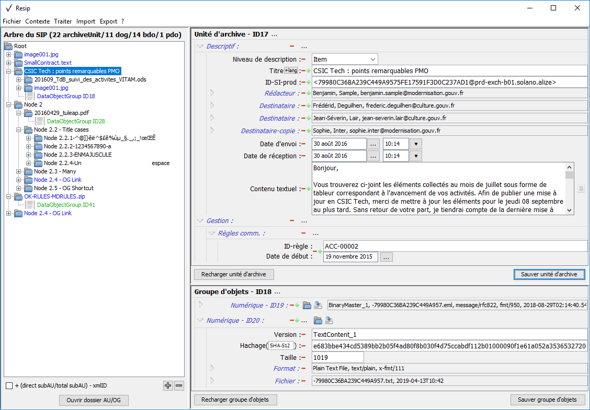

Pour uns présentation en français, suivre [ce lien](README.md).

sedatools project
=================

The project contains tools useful for developpers and testers for construction and manipulation of SEDA SIP.
It's a maven project with six modules:

* ``sedalib``: the SEDA library code (SIP manipulation)
* ``sedalib-samples``: some usage examples demonstrating complex SIP construction in a few lines
* ``mailextractlib``: the mailextract library code (mail containers SEDA conform extraction)

et
* ``resip``: the SIP creation and manipulation GUI
* ``mailextract``: the mail extraction GUI
* ``testsipgenerator``: the test SIP generation command tool

Build
-----

With JDK 1.8, git, maven and gpg installed, the build sequence is:

    mkdir test-sedatools
    cd test-sedatools
    git clone https://github.com/ProgrammeVitam/java-libpst-origin.git
    cd java-libpst-origin/
    mvn clean install
    cd ..
    git clone https://github.com/digital-preservation/droid.git
    cd droid
    # mvn parameters to skip a test failure in non english environement
    mvn clean install -DskipTests
    cd ..
    git clone https://github.com/ProgrammeVitam/sedatools.git
    cd sedatools/
    mvn clean install

The sedalib library and samples
===============================
This library is intended to manage archives structures and metadata confirming to the SEDA Standard (Standard d’échange de données pour l’archivage – SEDA – v. 2.1).

Sample application execution
----------------------------

    cd sedalib-samples
    java -jar target/sedalib-samples-{VERSION}-shaded.jar
    

The mailextract library
=======================
This library performs extraction and structure listing of mail boxes from different sources:

  * *IMAP* or *IMAPS* server with user/password login (and all others known by JavaMail, pop3, gmail...)
  * *Thunderbird directory* containing mbox files and .sbd directory hierarchy
  * *Outlook pst*, *Microsoft msg*, *RFC-4155 mbox* and *RFC-822 eml* files

The extraction generate on disk a directories/files structure convenient for SEDA archive packet (NF Z44-022) and directly usable by sedalib. More than that it normalises messages in eml 
(RFC 822) format, whatever the source is (even from pst). For detailed information see class StoreExtractor.

It uses :
* the JavaMail library for distant imap(s) and local Thunderbird extraction, 
* the java-libpst for local Outlook extraction (thanks to  to Richard Johnson http://github.com/rjohnsondev).
* the POI HSMF library for .msg Microsoft message extraction

Note: For now it can't extract S/MIME (ciphered and/or signed) messages.

The operation, extraction or listing, can be logged on console and file (root/username[-timestamp].log - cf args). 
At the different levels you can have: extraction errors (SEVERE), warning about extraction problems and items dropped (WARNING), information about global process (INFO), list of treated folders (FINE), list of treated messages (FINER), problems with some expected metadata (FINEST).
The default level of log is INFO for extracting and OFF for listing.

l'application MailExtract
=========================
This application based on mailextractlib is used for different mail containers (pst, thunderbird, imap, msg, mbox...) extraction in command line or graphic interface.

Execution
---------

    cd mailextract
    java -jar target/mailextract-{VERSION}-shaded.jar

On Windows, it's also possible to execute: windows/MailExtract.exe -h

GUI
---

The Resip application
=====================
This is the SIP creation and manipulation GUI.

Execution
---------

    cd ../resip
    java -jar target/resip-{VERSION}-shaded.jar

On Windows, it's also possible to execute: windows/Resip.exe -h

GUI
---

The TestSipGenerator tool
=============================
This command line tool generate SIP is used for injection tests generation.
You can choose depth of ArchiveUnit tree, number ans size of standard objects
distributed in the tree, number and size of big objects...

It has been developed with sedalib, and is so a sedalib usage sample code.

Execution
---------
To get the generation options, you can use --help ou -h argument.

    cd ../testsipgenerator
    java -jar target/testsipgenerator-{VERSION}-shaded.jar -h

On Windows, it's also possible to execute: windows/TestSipGenerator.exe -h

